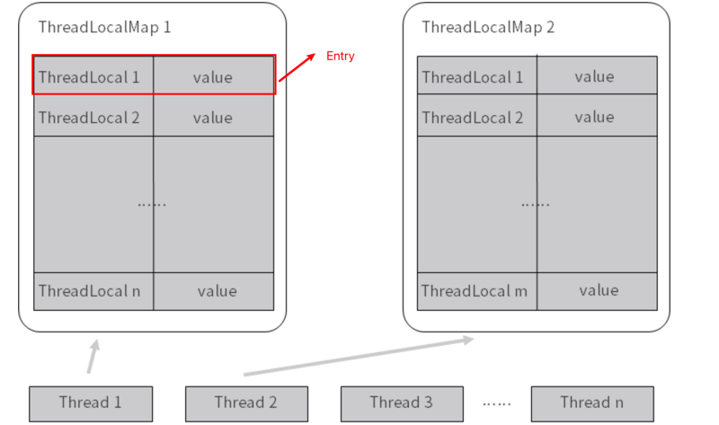

`ThreadLocal` 是 Java 提供的一个工具类，它为每个使用该变量的线程都提供了独立的变量副本。这意味着一个线程的 `ThreadLocal` 变量修改不会影响其他线程对该变量的访问。每个线程都可以拥有自己独立的 `ThreadLocal` 值，互不干扰。

### 一、`ThreadLocal` 的基本概念

`ThreadLocal` 提供了一种线程局部（Thread-Local）存储机制，使每个线程都拥有自己独立的变量副本，且这个副本只能被当前线程访问。

- **每个线程都持有一个 `ThreadLocal` 变量的副本**：即使多个线程访问同一个 `ThreadLocal` 实例，每个线程都拥有该变量的一个独立副本。
- **隔离性**：每个线程对 `ThreadLocal` 的操作只作用于自己的副本，不影响其他线程中的同一个 `ThreadLocal` 对象。

### 二、`ThreadLocal` 的常用方法

- **`set(T value)`**：将当前线程的 `ThreadLocal` 变量设置为 `value`。
- **`get()`**：获取当前线程的 `ThreadLocal` 变量的值。
- **`remove()`**：移除当前线程中 `ThreadLocal` 变量的值，防止内存泄漏。
- **`initialValue()`**：用于设置 `ThreadLocal` 变量的初始值。如果没有显式调用 `set()` 方法，线程第一次调用 `get()` 时会返回 `initialValue()` 的值。

### 三、`ThreadLocal` 的工作原理

`ThreadLocal` 为每个线程维护一个 `ThreadLocalMap`，存储该线程的 `ThreadLocal` 变量副本。`ThreadLocalMap` 是 `Thread` 类的一个成员变量。每个线程的 `ThreadLocalMap` 键是 `ThreadLocal` 实例，值是 `ThreadLocal` 变量的副本。

#### 1. **线程内存中的 `ThreadLocalMap`**

每个线程都有自己的 `ThreadLocalMap`。`ThreadLocalMap` 是 `Thread` 类中的一个成员变量，负责存储当前线程的所有 `ThreadLocal` 变量的值。每次调用 `ThreadLocal.set()` 或 `ThreadLocal.get()`，都是通过这个 `ThreadLocalMap` 来存取当前线程中的 `ThreadLocal` 变量值。

#### 2. **`ThreadLocalMap` 的键值结构**

- 键：`ThreadLocal` 对象本身。
- 值：存储在 `ThreadLocalMap` 中的值，是每个线程独有的副本。

当一个线程第一次调用 `ThreadLocal.get()` 时，`ThreadLocal` 会为该线程生成一个初始值并存入 `ThreadLocalMap`。后续的 `get()` 调用将从 `ThreadLocalMap` 中返回这个值。

### 四、`ThreadLocal` 示例

下面是一个简单的示例，展示如何使用 `ThreadLocal` 来为每个线程提供独立的变量副本：

```java
public class ThreadLocalExample {
    // 创建一个 ThreadLocal 变量，用于存储每个线程的独立副本
    private static ThreadLocal<Integer> threadLocalValue = ThreadLocal.withInitial(() -> 1);

    public static void main(String[] args) {
        // 创建第一个线程
        Thread thread1 = new Thread(() -> {
            System.out.println("Thread 1 initial value: " + threadLocalValue.get());
            threadLocalValue.set(threadLocalValue.get() + 1);  // 修改当前线程的 ThreadLocal 变量
            System.out.println("Thread 1 updated value: " + threadLocalValue.get());
        });

        // 创建第二个线程
        Thread thread2 = new Thread(() -> {
            System.out.println("Thread 2 initial value: " + threadLocalValue.get());
            threadLocalValue.set(threadLocalValue.get() + 2);  // 修改当前线程的 ThreadLocal 变量
            System.out.println("Thread 2 updated value: " + threadLocalValue.get());
        });

        thread1.start();
        thread2.start();
    }
}
```

#### 输出示例：

```
Thread 1 initial value: 1
Thread 1 updated value: 2
Thread 2 initial value: 1
Thread 2 updated value: 3
```

在这个示例中，虽然两个线程都使用了同一个 `ThreadLocal` 变量 `threadLocalValue`，但是每个线程对它的操作是完全独立的，互不干扰。

- `Thread 1` 修改了自己的 `ThreadLocal` 变量副本，结果与 `Thread 2` 的操作互不影响。
- `ThreadLocal.withInitial()` 方法设置了初始值，第一次调用 `get()` 会返回这个值。

### 五、`ThreadLocal` 的典型应用场景

#### 1. **数据库连接管理**

在多线程环境下，每个线程需要使用独立的数据库连接，避免多个线程同时使用一个连接。

```java
public class DatabaseConnectionManager {
    private static ThreadLocal<Connection> connectionHolder = ThreadLocal.withInitial(() -> {
        // 创建并返回数据库连接
        return createNewConnection();
    });

    public static Connection getConnection() {
        return connectionHolder.get();
    }
}
```

#### 2. **用户会话管理**

在 Web 应用程序中，常常需要在每个线程中存储与当前用户会话相关的上下文数据。

```java
public class UserContext {
    private static ThreadLocal<String> currentUser = new ThreadLocal<>();

    public static void setCurrentUser(String user) {
        currentUser.set(user);
    }

    public static String getCurrentUser() {
        return currentUser.get();
    }

    public static void clear() {
        currentUser.remove();
    }
}
```

#### 3. **线程隔离的日志跟踪**

可以使用 `ThreadLocal` 进行分布式系统的日志跟踪，将日志信息与线程绑定，确保日志记录不会在线程间混乱。

### 六、`ThreadLocal` 的优点

1. **线程隔离**：每个线程有独立的变量副本，变量不受其他线程的影响，避免了线程间的竞争。
2. **方便数据共享**：每个线程可以方便地共享自己线程内的数据，而不需要显式传递数据。
3. **简化多线程编程**：在某些需要线程隔离的场景中，`ThreadLocal` 提供了一种简便的方式，避免了复杂的锁机制。

### 七、`ThreadLocal` 的潜在问题与注意事项

1. **内存泄漏问题**：
    - `ThreadLocal` 可能引发内存泄漏，特别是在使用线程池时。因为线程池中的线程会被重复使用，线程结束时并不会自动清理 `ThreadLocal` 的值。
    - 解决方案：在线程任务完成后，显式调用 `ThreadLocal.remove()` 方法，清理线程中的 `ThreadLocal` 值，避免内存泄漏。

   ```java
   threadLocal.remove();
   ```

2. **不可共享数据**：
    - `ThreadLocal` 只适合线程内部的数据隔离。如果多个线程需要共享数据，`ThreadLocal` 并不是合适的解决方案。

3. **调试困难**：
    - `ThreadLocal` 隔离性强，因此当调试跨线程访问时，可能不容易发现问题，因为每个线程的状态都是独立的。

### 八、总结

- `ThreadLocal` 提供了一种非常简洁的方式来实现线程局部变量，它确保每个线程都有自己的变量副本，互不干扰。
- 典型的应用场景包括数据库连接管理、用户会话管理和日志跟踪等。
- 在使用 `ThreadLocal` 时，务必注意内存泄漏问题，尤其是在使用线程池的场景中，要记得清理 `ThreadLocal` 值。

通过 `ThreadLocal`，可以简化线程间的数据隔离，实现更加灵活、便捷的并发编程。不过在实际使用中，要根据场景和需求合理使用它，避免滥用带来的问题。


# ThreadLocal 是用来解决共享资源的多线程访问的问题吗？
这是一个常见的面试问题，如果被问到了 ThreadLocal，则有可能在你介绍完它的作用、注意点等内容之后，
再问你：ThreadLocal 是不是用来解决共享资源的多线程访问的呢？假如遇到了这样的问题，其思路一定要清晰。

## 面试时被问到应如何回答
这道题的答案很明确——不是，ThreadLocal 并不是用来解决共享资源问题的。虽然 ThreadLocal 确实可以用于解决多线程情况下的线程安全问题，但其资源并不是共享的，而是每个线程独享的。所以这道题其实是有一定陷阱成分在内的。
ThreadLocal 解决线程安全问题的时候，相比于使用“锁”而言，换了一个思路，把资源变成了各线程独享的资源，非常巧妙地避免了同步操作。具体而言，它可以在 initialValue 中 new 出自己线程独享的资源，而多个线程之间，它们所访问的对象本身是不共享的，自然就不存在任何并发问题。这是 ThreadLocal 解决并发问题的最主要思路。
如果我们把放到 ThreadLocal 中的资源用 static 修饰，让它变成一个共享资源的话，那么即便使用了 ThreadLocal，同样也会有线程安全问题。

## ThreadLocal 和 synchronized 是什么关系
面试官可能会问：你既然说 ThreadLocal 和 synchronized 它们两个都能解决线程安全问题，那么 ThreadLocal 和 synchronized 是什么关系呢？

我们先说第一种情况。当 ThreadLocal 用于解决线程安全问题的时候，也就是把一个对象给每个线程都生成一份独享的副本的，在这种场景下，ThreadLocal 和 synchronized 都可以理解为是用来保证线程安全的手段。

既使用了 synchronized 来达到目的，也使用了 ThreadLocal 作为实现方案。但是效果和实现原理不同：

ThreadLocal 是通过让每个线程独享自己的副本，避免了资源的竞争。
synchronized 主要用于临界资源的分配，在同一时刻限制最多只有一个线程能访问该资源。
相比于 ThreadLocal 而言，synchronized 的效率会更低一些，但是花费的内存也更少。在这种场景下，ThreadLocal 和 synchronized 虽然有不同的效果，不过都可以达到线程安全的目的。

但是对于 ThreadLocal 而言，它还有不同的使用场景。比如当 ThreadLocal 用于让多个类能更方便地拿到我们希望给每个线程独立保存这个信息的场景下时（比如每个线程都会对应一个用户信息，也就是 user 对象），在这种


# 多个 ThreadLocal 在 Thread 中的 threadlocals 里是怎么存储的？

在 `ThreadLocal` 的内部实现中，有一个关键的数据结构叫做 **`ThreadLocalMap`**，它是 `ThreadLocal` 用来为每个线程存储独立变量副本的内部类。`ThreadLocalMap` 类似于一个 `HashMap`，它的每个条目（`Entry`）用来存储 `ThreadLocal` 实例和线程特定的变量值。

### 一、`ThreadLocalMap.Entry` 详解

#### 1. **`ThreadLocalMap.Entry` 是什么？**

`ThreadLocalMap.Entry` 是 `ThreadLocalMap` 中的一个静态内部类，用来存储 `ThreadLocal` 实例和其关联的线程局部变量。它与 `HashMap` 的 `Entry` 类似，但有一些特别的地方。

- **`ThreadLocal` 是键**：在 `ThreadLocalMap` 中，`Entry` 的键是 `ThreadLocal` 对象本身，而不是普通的 `Object`。
- **值为线程的局部变量**：`Entry` 的值是 `ThreadLocal` 对应的线程局部变量。

#### 2. **`ThreadLocalMap.Entry` 的定义**

`ThreadLocalMap.Entry` 是 `ThreadLocalMap` 的内部类，源码如下：

```java
static class Entry extends WeakReference<ThreadLocal<?>> {
    /** The value associated with this ThreadLocal. */
    Object value;

    Entry(ThreadLocal<?> k, Object v) {
        super(k);  // 键（Key）是 `ThreadLocal` 对象，并使用弱引用存储
        value = v; // 值（Value）是线程局部变量的值
    }
}
```

从这个定义可以看出：
- `Entry` 继承自 `WeakReference<ThreadLocal<?>>`，这意味着 `Entry` 的键是 `ThreadLocal` 的弱引用。
- `value` 字段是与 `ThreadLocal` 关联的线程局部变量。

#### 3. **为什么使用弱引用？**

`ThreadLocalMap.Entry` 中的键使用的是**弱引用**（`WeakReference`）。弱引用有助于避免内存泄漏：

- **弱引用的作用**：当一个对象（这里是 `ThreadLocal` 实例）只被弱引用所引用时，一旦垃圾回收器发现没有强引用指向这个对象，它就会被回收。
- **避免内存泄漏**：如果不使用弱引用，`ThreadLocal` 实例可能被长时间保留，导致与之关联的线程局部变量无法被回收，从而引发内存泄漏。
- **垃圾回收**：当 `ThreadLocal` 被垃圾回收时，`Entry` 的键（`ThreadLocal` 弱引用）会被清空为 `null`，但其值仍然存在，直到显式调用 `remove()` 或 `ThreadLocalMap` 进行清理。

#### 4. **`value` 的生命周期**

即使 `ThreadLocal` 被回收了，由于 `value` 没有使用弱引用，它可能仍然会占据内存。这就是为什么使用 `ThreadLocal` 时，最好在使用完后调用 `remove()` 方法，以显式地清除当前线程的 `ThreadLocal` 值，防止内存泄漏。

```java
threadLocal.remove();
```

### 二、`ThreadLocalMap` 的工作流程

`ThreadLocalMap` 通过维护一组 `Entry` 来存储线程局部变量，它的键是 `ThreadLocal` 实例，值是与之关联的线程局部数据。每个线程都有一个自己的 `ThreadLocalMap`，它在 `Thread` 类中被定义。

#### 1. **设置值 `set()`**

当你调用 `ThreadLocal.set()` 方法时，`ThreadLocalMap` 会将当前线程的 `ThreadLocal` 作为键，并将传递的值作为 `value` 存储在 `ThreadLocalMap.Entry` 中。

```java
public void set(T value) {
    Thread t = Thread.currentThread();
    ThreadLocalMap map = getMap(t);
    if (map != null)
        map.set(this, value);  // 将 ThreadLocal (this) 和 value 存储在 Entry 中
    else
        createMap(t, value);
}
```

#### 2. **获取值 `get()`**

当调用 `ThreadLocal.get()` 时，`ThreadLocalMap` 会根据当前线程找到对应的 `Entry`，然后返回存储的值。

```java
public T get() {
    Thread t = Thread.currentThread();
    ThreadLocalMap map = getMap(t);
    if (map != null) {
        ThreadLocalMap.Entry e = map.getEntry(this);
        if (e != null) {
            @SuppressWarnings("unchecked")
            T result = (T)e.value;
            return result;
        }
    }
    return setInitialValue();
}
```

#### 3. **移除值 `remove()`**

`remove()` 方法用于显式删除当前线程中 `ThreadLocalMap` 中的 `Entry`，避免长时间占用内存。

```java
public void remove() {
    ThreadLocalMap m = getMap(Thread.currentThread());
    if (m != null)
        m.remove(this);
}
```

### 三、内存泄漏问题

由于 `ThreadLocalMap` 使用的是弱引用的键（`ThreadLocal`），但其值（线程局部变量）是强引用，因此即便 `ThreadLocal` 本身被垃圾回收了，`value` 仍然可能保留在内存中，导致内存泄漏。为了解决这个问题，开发者应该在合适的时机调用 `ThreadLocal.remove()` 以清理相关数据。

#### 1. **常见的内存泄漏场景**

- 当线程池中的线程反复使用同一个 `ThreadLocal` 对象，且 `ThreadLocal` 被回收了，而没有调用 `remove()`，导致 `value` 无法被回收。
- 特别是在长生命周期的线程中（如线程池），未及时清理 `ThreadLocal` 变量可能会导致内存无法释放。

#### 2. **如何避免内存泄漏？**

- **手动调用 `remove()`**：在使用完 `ThreadLocal` 后，显式调用 `ThreadLocal.remove()` 来清理数据，避免内存泄漏。

```java
threadLocal.remove();
```

- **正确使用场景**：避免在线程池这种长生命周期的线程中错误使用 `ThreadLocal`，确保它们及时清理数据。

### 四、总结

- **`ThreadLocalMap.Entry` 是 `ThreadLocalMap` 中存储键值对的内部类**。键是 `ThreadLocal` 实例（使用弱引用），值是线程局部变量。
- **弱引用机制**：`ThreadLocalMap.Entry` 使用弱引用存储 `ThreadLocal` 键，这有助于防止 `ThreadLocal` 引用的泄漏。一旦 `ThreadLocal` 被回收，键会变为 `null`，但值仍可能保留，因此需要显式清理。
- **内存泄漏风险**：`ThreadLocal` 使用不当时，可能会导致内存泄漏。为避免这种问题，建议在使用完 `ThreadLocal` 后，调用 `remove()` 方法。

`ThreadLocal` 是一种非常强大且灵活的工具，能有效避免并发访问问题，但开发者在使用时必须注意潜在的内存泄漏风险，尤其是在长生命周期的线程中。


# 为何每次用完 ThreadLocal 都要调用 remove()？
每次使用完 `ThreadLocal` 后，建议调用 `remove()` 的主要原因是为了防止**内存泄漏**，尤其是在使用**线程池**等长生命周期线程的情况下。内存泄漏的风险主要源于 `ThreadLocalMap` 的工作原理和 `ThreadLocal` 中使用的**弱引用机制**。

### 一、`ThreadLocal` 内存泄漏的原因

要理解为什么要调用 `remove()`，我们需要先理解 `ThreadLocal` 的实现细节和内存泄漏的可能性。

#### 1. **`ThreadLocalMap` 的工作原理**
每个线程中都维护一个 `ThreadLocalMap`，它是 `Thread` 类中的一个成员变量。这个 `ThreadLocalMap` 用来存储该线程使用的所有 `ThreadLocal` 对象的值。`ThreadLocalMap` 的键是 `ThreadLocal` 实例，而值是该 `ThreadLocal` 实例在当前线程中的值。

- 键：`ThreadLocal` 实例（用**弱引用**存储）。
- 值：`ThreadLocal` 变量的值（用**强引用**存储）。

#### 2. **弱引用的作用**
`ThreadLocalMap.Entry` 中的键使用的是**弱引用**，这意味着：
- 当 `ThreadLocal` 实例不再被任何地方引用时，它会被垃圾回收（GC）回收，`Entry` 中的键会被清空为 `null`。
- 但是，**值**是强引用的，它不会自动被回收，即使键已经被回收。如果没有显式清除，这个值仍然会保留在内存中，导致**内存泄漏**。

#### 3. **内存泄漏的发生**
当 `ThreadLocal` 实例被回收后，`ThreadLocalMap` 的 `Entry` 键就变为 `null`，但是与之对应的值仍然存在，并且由于线程的生命周期较长（特别是在使用线程池的情况下），这些值可能长期无法被回收，导致内存泄漏。

#### 4. **长生命周期的线程（如线程池）**
在常规的线程中，当线程结束时，`ThreadLocalMap` 以及它内部的 `Entry` 都会被回收。但是在使用线程池时，线程通常不会被销毁，而是被重复使用，因此即便 `ThreadLocal` 的键被回收了，它的值仍然保留在 `ThreadLocalMap` 中，无法被垃圾回收，从而导致内存泄漏。

### 二、为什么要调用 `remove()`？

调用 `ThreadLocal.remove()` 方法可以显式地清除 `ThreadLocalMap` 中与当前 `ThreadLocal` 对象关联的值。这样做的原因是：

1. **避免内存泄漏**：当调用 `remove()` 时，`ThreadLocalMap` 中对应的键值对会被删除，清除键和对应的值。这样即使 `ThreadLocal` 键被回收，也不会残留没有被清除的值。

2. **保持内存清洁**：及时调用 `remove()` 可以确保线程的 `ThreadLocalMap` 中不会积累过多的无效数据，从而保持内存的清洁。

### 三、如何正确使用 `ThreadLocal`？

为了避免内存泄漏，建议在使用完 `ThreadLocal` 后调用 `remove()`，尤其是在以下情况下：

1. **使用线程池时**：线程池中的线程生命周期较长，如果不清理 `ThreadLocal`，会导致值无法及时回收。因此，在使用线程池的场景中，必须显式调用 `remove()` 以防止内存泄漏。

2. **长时间运行的线程**：即使不使用线程池，对于那些长时间运行的线程，`ThreadLocal` 值也可能长期存在内存中。为了确保这些值不会造成内存浪费，使用 `remove()` 是一个很好的实践。

### 四、示例代码

下面是一个正确使用 `ThreadLocal` 的示例，展示了如何在使用完 `ThreadLocal` 之后调用 `remove()`：

```java
public class ThreadLocalExample {
    private static ThreadLocal<String> threadLocal = new ThreadLocal<>();

    public static void main(String[] args) {
        Thread thread1 = new Thread(() -> {
            threadLocal.set("Thread 1 data");
            System.out.println("Thread 1: " + threadLocal.get());

            // 使用完后清理
            threadLocal.remove();
        });

        Thread thread2 = new Thread(() -> {
            threadLocal.set("Thread 2 data");
            System.out.println("Thread 2: " + threadLocal.get());

            // 使用完后清理
            threadLocal.remove();
        });

        thread1.start();
        thread2.start();
    }
}
```

在这个示例中，每个线程使用 `ThreadLocal` 存储并访问独立的数据，执行完毕后会调用 `remove()` 以避免占用内存。

### 五、何时不需要显式调用 `remove()`？

虽然显式调用 `remove()` 是一个好的实践，但在某些情况下它不是必需的，例如：

1. **短生命周期线程**：如果线程生命周期较短，在线程执行完毕后，它的所有数据（包括 `ThreadLocalMap`）都会被垃圾回收。在这种情况下，显式调用 `remove()` 并不是强制的，因为线程结束后内存会自动被释放。

2. **应用的线程退出后**：如果线程在应用结束时退出，JVM 会清理所有资源，包括 `ThreadLocal` 和其存储的值。

尽管如此，为了保持代码的健壮性和可维护性，尤其是在无法确定线程生命周期长短的情况下，还是推荐在使用完 `ThreadLocal` 后调用 `remove()`。

### 六、总结

每次用完 `ThreadLocal` 都调用 `remove()` 的原因主要是为了**防止内存泄漏**，尤其是在长生命周期的线程（如线程池）中。通过调用 `remove()`，你可以确保 `ThreadLocalMap` 中的无效数据及时被清理，避免占用不必要的内存。

因此，在使用 `ThreadLocal` 时，应该将调用 `remove()` 作为一种良好的编程实践，确保每个线程使用完 `ThreadLocal` 变量后能够及时清理其值，防止内存泄漏。